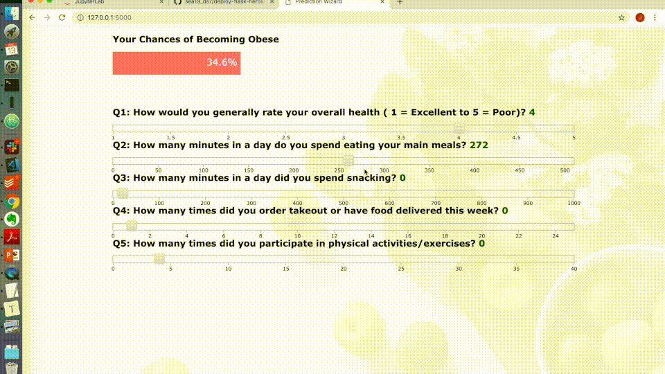

# Predicting obesity based on weekly habits 

Project-2 at METIS Data Science bootcamp

**Focus**: Supervised learning (classification), SQL, and Flask

> Problem Statement:
>
> - What (minor) life adjustments can we make today, to avoid obesity-related diseases?

## Project Description

Obesity-related diseases are the leading cause of death in the United States [1]. People that are obese have higher chances of developing heart disease, hypertension, stroke, and even (some) cancers [2]. Although nobody intentionally seeks ways to become obese, many would admit that they should live a better and healthier lifestyle. This irony brings into question how our (seemingly harmless) habits of snacking or dining out affects our chances of becoming obese. One may also wonder about the impact of physical exercise, or lack thereof, on our weight and overall health.    

Read the full story in [my Blog](https://jhonsen.github.io/2019/03/01/Obesity-Prediction/)

**Project Objectives**:

- [x] Use SQL to store and access the original dataset into local machine

- [x] Use supervised learning, i.e., classification method, to predict obesity

- [x] Deploy model using Flask and D3.js

**Code, notebooks, and documents**

- [Project_Report.md](./docs/Project_Report.md), [Project_Presentation.pptx](./docs/Project_Presentation.pptx), or [PDF](./docs/Project_Presentation.pdf) - project report on markdown and powerpoint (or pdf) formats 
- [Step1_Import_and_Clean.ipynb](./notebooks/Step1_Import_and_Clean.ipynb) - notebook on importing dataset and initial cleaning
- [Step1b_Import_to_DB.ipynb](./notebooks/Step1b_Import_to_DB.ipynb) - notebook on importing csv dataset into local PostgreSQL database, querying, and extracting into pandas
- [Step2_EDA.ipynb](./notebooks/Step2_EDA.ipynb) and [Step3_Modeling.ipynb](./notebooks/Step3_Modeling.ipynb) - notebooks on quick EDA & modeling
- [Step4_RandomForest_Explainer.ipynb](./notebooks/Step4_RandomForest_Explainer.ipynb) - notebook on using Local Interpretable Model-agnostic Explainer (LIME) on Random Forest 
