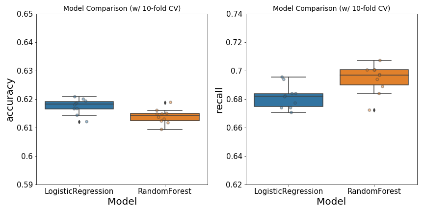
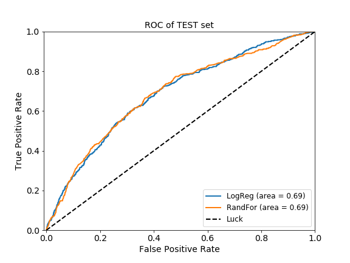
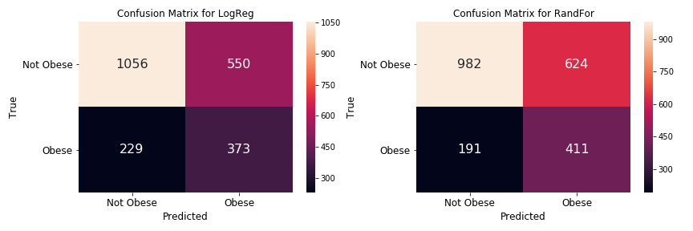
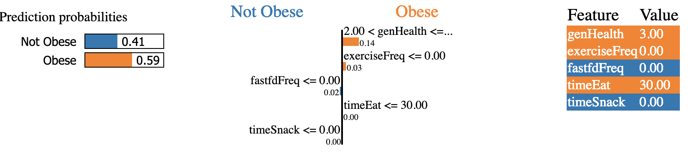

# PROJECT Report 

**Focus:** Supervised Learning (Classification), SQL, and Flask 

---

> **Problem Statement:** 
>
> - What (minor) life adjustments can we make today, to avoid obesity-related diseases?

  

### Project Description

Obesity-related diseases are the leading cause of death in the United States [1]. People that are obese have higher chances of developing heart disease, hypertension, stroke, and even (some) cancers [2]. Although nobody intentionally seeks ways to become obese, many would admit that they should live a better and healthier lifestyle. This irony brings into question how our (seemingly harmless) habits of snacking or dining out affects our chances of becoming obese. One may also wonder about the impact of physical exercise, or lack thereof, on our weight and overall health.    

**Objectives:**

- [x] Use SQL to store and access the original dataset into local machine

- [x] Use supervised learning, i.e., classification method, to predict obesity

- [x] Deploy model using Flask and D3.js

  

### Data acquisition, cleaning, and pre-processing

- The dataset originates from a multi-year survey, spanning from This set contains 11,212 observations and 39 features. This dataset was split into training (80%) and test sets (20%) with stratification based on the target class, to reflect the 'original' proportion.
  - The test set was used to evaluate model performance (after the best model was chosen)
-  The *target response* was obtained from one of the features in the survey questions, i.e., body mass index (BMI). Anyone with BMI>30 was classified as obese, whereas one with BMI<30 was considered not obese. The ratio of obese and not obese was 72%:28%.

- The random-oversampling method from `imblearn` was used to create a balance set, resulting in ~6000 rows for each class. 

- Five features were selected for the models, and they were also the top 5 most important features considered by Random Forest classifier:

  - TimeEat - the total time (min) spent in primary meals in a day [Numeric].
  - TimeSnack - the total time (min) spent in secondary meals/snack in a day [Numeric]
  - ExerciseFreq - the number of times an individual participates in a physical activity [Numeric]. Individuals who didnt answer this question were removed from the dataset, and those who didnt exercise were recoded to 0 (from -1).
  - FastfoodFreq - the number of times an individual orders takeouts or have food delivered [Numeric]. Individuals who didnt answer this question were removed from the dataset. Those who didn't answer this question were removed from the dataset, and those who didnt buy fastfood were recoded to 0 (from -1). 
  - GeneralHealth - the general feel of an individual's health [Ordinal Category:1,2,3,4,5]. These were integer-coded to reflect its order. 

  

### Machine learning to predict obesity chances    

- Two models were investigated: Logistic Regression (LR) and Random Forest (RF) classifiers. A pipeline that runs feature scaling and 10-fold CV was setup to run `LogisticRegression`, `RandomForestClassifier` 

- With the training set, grid-search with 10-fold cross-validations were performed on both LR and RF models. The resulting optimized models were used to predict on the test set. Performance measures (ROC curves, accuracy and recall) were also collected from this step.  

- Then the optimized RF was used for deployment. That is, the entire set (training and test) was used to train an optimized RF model for Python `flask` app, utilizing `d3.js` sliders as the input method. This prediction app was deployed and now hosted in `heroku`   

    

### Results

- In general, the performance of Logistic Regression (LR) is comparable with that of Random Forest (RF) model (**Figure 1**). The LR model has a slightly higher <u>accuracy</u> than RF. However, the <u>recall score</u> for RF is better than that of LR. The latter is of great importance in healthcare, as it would be costly to misclassify someone who has an obesity-related disease as healthy. For this reason, the Random Forest Classifier was chosen as the best model to use for testing and deployment.  

   

  **Figure 1**. Performance of Logistic Regression and Random Forest classifiers on the training set. Hyper-parameters used in each model was optimezed using grid-search-CV. *Left*, the accuracy of each model was computed with 10-fold cross-validation. *Right*, the recall score was also computed over 10-fold cross-validation process. Jittered points on box-and-whiskers reflect scores for each of the ten folds.      

- In general, the two models perform similarly on the test-set. Similar AUC scores (~0.69) were obtained LR and RF (**Figure 2**).  

  

  **Figure 2.** ROC curves of the LR and RF classifiers. Curves were generated with predicted and true target values of the test set. Diagonal dashed line indicates random chance. 

- Higher <u>recall</u> score in the RF classifier means that we are better at detecting obesity in people, *which potentially would save more lives*. Specifically, the RF classifier has fewer False Negative (191) than LR (229), as illustrated in **Figure 3**. This means, we would have saved 32 people by just using RF classifier instead of LR.  

  

  **Figure 3**. Confusion matrices for LR and RF classifiers. These diagrams were generated using true and predicted target values of the test set.  

- The interpretability aspect of RF classifier (a "black-box"-like model) was partially recovered using Local Interpretable Model-agnostic Explainer (LIME)[4]. This package allows us to investigate the effect of feature-variations on the prediction result (which is consistent with the theme of this project). For instance, a given obese individual is predicted to be obese by the RF classifier, with  P(obese) of 0.59 (*left* of **Figure 4**). We could calculate how P(obese) changes with the increase of a particular feature or a combination of features. In this case, this individual did not participate in any type of exercises, i.e. **0** *exerciseFreq* (*right*). If we were to suggest this person to start exercising, just 4 times a week (i.e., we increase *exerciseFreq* to **4** in our model), then the P(obese) would decrease to 0.56, indicating that this person would have lower chances of being obese. This type of calculation can be performed for each feature (or any combinations of features) at any increments. LIME outputs the overall effect of feature changes on the prediction probabilities  (*middle* of figure). 

  

  **Figure 4**. Output of LIME on RF predictions on a given individual. *Left*, prediction probabilities for a given individual. *Middle*, the average impact of each feature on the probability of being obese, P(obese).  This figure is representative of case_ID #001 (i.e., a single observation in the test set). 

- In conclusion, using RF and LIME together to predict obesity seems to be an appropriate approach, as this combination provides both predictive power and interpretability.   

  

> **Problem Solution:**
>
> - What (minor) life adjustments can we make today, to avoid obesity-related diseases?
>   - The deployed [model](https://obesity-predictor.herokuapp.com/) will hopefully provide a personalized answer to this question      

### Future work

 - *Model improvement*. Interpretability is an important issue in healthcare industry, as we need to be able to explain to clients how a particular action/habit may give a certain outcome. Consquently, implementing a simple interpretable model like logistic regression would be suitable. So, exploring feature engineering for a logistic model would be one option that I'd like to investigate in the future. In particular, I'd be interested in applying various feature transformations, (especially) because the variables were not normally distributed. I'd like to also see the impact of adding more features to the current model (only 5 were considered at this point). Alternatively, I'd like to explore other combinations of LIME and ensemble models, to get a better predictive power yet maintain some of the explainable aspect.   

 - *Collect more data*. Currently, only 6-years worth of data is available, spanning from 2006 to 2008 and from 2014 to 2016. I'd like to collect more data (as they become available) and retrain my model. I'd also be interested in looking at non-survey data from elsewhere, as this current project hinges upon an _assumption_ that the experimental data is reliable. In other words, I had assumed that people who were surveyed woud answer those questions accurately. In reality, I'd suspect that there would be some inconsistencies, i.e., people could be forgetful, or feel apprehensive about sharing (private) information, etc. Furthermore, the current survey questions were focused on individuals' habits over the past 7 days, which may not be a representative of a person's "true" lifestyle. For instance, an obese individual who happened to have started a new diet & exercise routine (during the surveyed week) would have answered these questions in a way that reflects his/her "new" lifestyle, as opposed to the previous one. Lastly, I'd like to try using other metrics to reflect obesity. The *target* response used for this model is based on BMI, which may not be indicative of obesity. For instance, someone who has a great body mass (e.g., a crossfitter or bodybuilder) is typically considered obese, based on BMI. So playing around with this target measure may give a more insightful outcome.             ​     

   

### Data Source and toolsets

**Data sources:**

- [Bureau of Labor Statistics](https://www.bls.gov/tus/ehdatafiles.htm)

**Tools:**

- Data acquisition: `Postgresql`, `csvkit`
- Data analysis: `Pandas`, `seaborn`, `LIME`
- Models: `Scikit-learn` (i.e., Logistic Regression & Random Forest)
- Model deployment: `D3`, `Flask`, hosted on `Heroku`

**Attribution:**

- This project was inspired by a *linear regression* challenge on [Kaggle](https://www.kaggle.com/bls/eating-health-module-dataset).

  

**References:**

1. *Leading causes of death* report from [CDC](https://www.cdc.gov/nchs/fastats/leading-causes-of-death.htm)
2. *Health risks of obesity* from [MedlinePlus](https://medlineplus.gov/ency/patientinstructions/000348.htm)
3. *Defining adult overweight and obesity* from [CDC]( https://www.cdc.gov/obesity/adult/defining.html)
4. Local Interpretable Model-agnostic Explainer (LIME), as explained in [blog](https://www.oreilly.com/learning/introduction-to-local-interpretable-model-agnostic-explanations-lime), [github](https://github.com/marcotcr/lime), and technical paper on [arxiv](https://arxiv.org/abs/1602.04938)

---

